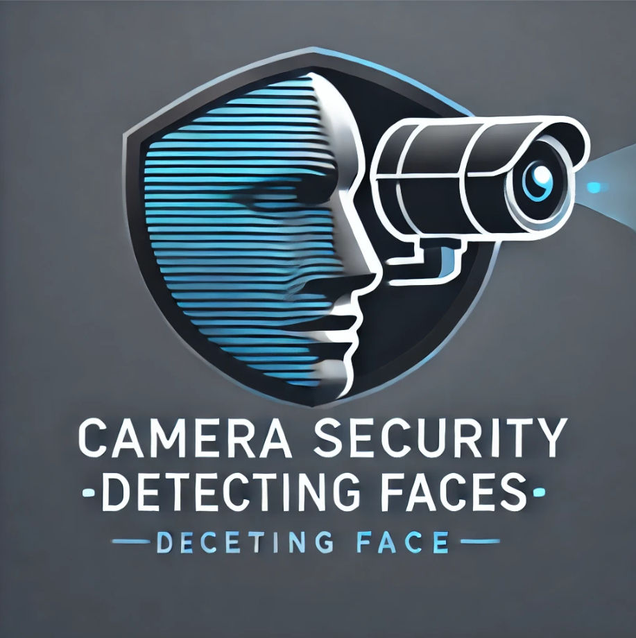

<a id="readme-top"></a>

[![Contributors][contributors-shield]][contributors-url]
[![Forks][forks-shield]][forks-url]
<!-- [![Stargazers][stars-shield]][stars-url] -->
[![Issues][issues-shield]][issues-url]
<!-- [![MIT License][license-shield]][license-url] -->
<!-- [![LinkedIn][linkedin-shield]][linkedin-url] -->


<!-- PROJECT LOGO -->
<br />
<div align="center">
  <a href="https://github.com/lujain-Sh/shooting-non-friends">
    
  </a>

<h3 align="center">Camera_Security_Detecting_Faces</h3>

  <p align="center">
    Using a camera with a launcher to secure an important place , by using Opencv Python and Arduino
    <br />
    <a href="https://github.com/lujain-Sh/shooting-non-friends"><strong>Explore the docs »</strong></a>
    <br />
    <br />
    <!-- <a href="https://github.com/github_username/repo_name">View Demo</a>
    · -->
    <!-- <a href="https://github.com/github_username/repo_name/issues/new?labels=bug&template=bug-report---.md">Report Bug</a>
    ·
    <a href="https://github.com/github_username/repo_name/issues/new?labels=enhancement&template=feature-request---.md">Request Feature</a> -->
  </p>
</div>


<!-- TABLE OF CONTENTS -->
<details>
  <summary>Table of Contents</summary>
  <ol>
    <li>
      <a href="#about-the-project">About The Project</a>
      <ul>
        <li><a href="#built-with">Built With</a></li>
      </ul>
    </li>
    <li>
      <a href="#getting-started">Getting Started</a>
      <ul>
        <li><a href="#prerequisites">Prerequisites</a></li>
        <li><a href="#installation">Installation</a></li>
      </ul>
    </li>
    <li><a href="#usage">Usage</a></li>
    <li><a href="#roadmap">Roadmap</a></li>
    <li><a href="#contributing">Contributing</a></li>
    <li><a href="#license">License</a></li>
    <li><a href="#contact">Contact</a></li>
    <li><a href="#acknowledgments">Acknowledgments</a></li>
  </ol>
</details>


<!-- ABOUT THE PROJECT -->
## About The Project

<!-- [![Product Name Screen Shot][product-screenshot]](https://example.com) -->

A camera rotates 180 degrees using a servo motor. When it detects a person whose image is in the code's database, it recognizes them as safe. However, if it doesn't find their image, the camera identifies them as an unknown person, causing it to stop. A launcher powered by a servo motor is activated to target this person, and an alarm sounds. Additionally, a warning email is sent to the person intended to be alerted. 

<p align="right">(<a href="#readme-top">back to top</a>)</p>


### Built With

* 
* 
* 

<p align="right">(<a href="#readme-top">back to top</a>)</p>


<!-- GETTING STARTED -->
## Getting Started

Using vscode to setup the enviroment to use this code.

### Prerequisites
- Python 3.8 or higher
- Arduino IDE
- OpenCV library
- NumPy library
- face_recognition library
- pyserial library
- mailer library

### Installation

1. Clone the repo
   ```sh
   git clone https://github.com/lujain-Sh/shooting-non-friends.git
   ```
2. Set up a Python virtual environment (optional but recommended):
   python -m venv venv
  source venv/bin/activate  # On Windows use `venv\Scripts\activate`

3. Upgrade pip (if necessary):
   pip install --upgrade pip

4. Install the required packages:
   pip install opencv-python numpy cmake wheel dlib face_recognition pyserial mailer

5. Upload the Arduino sketch 

6. Run the main script:
   python main.py


<p align="right">(<a href="#readme-top">back to top</a>)</p>


<!-- USAGE EXAMPLES -->


<!-- ROADMAP -->
## Roadmap


Feature 1: Basic Face Recognition

Implement basic face detection using OpenCV.
Integrate recognition against a pre-defined database of faces.

Feature 2: Camera Control

Enable 180-degree rotation of the camera using a servo motor.
Implement smooth camera movement and positioning.

Feature 3: Unknown Person Detection

Develop functionality to identify unknown persons.
Trigger alarm and launcher mechanism for unauthorized individuals.

Feature 4: Email Notifications

Implement email alert system to notify specified users when an unknown person is detected.

See the [open issues](https://github.com/lujain-Sh/shooting-non-friends/issues) for a full list of proposed features (and known issues).

<p align="right">(<a href="#readme-top">back to top</a>)</p>


<!-- CONTRIBUTING -->
## Contributing

Contributions are what make the open source community such an amazing place to learn, inspire, and create. Any contributions you make are **greatly appreciated**.

If you have a suggestion that would make this better, please fork the repo and create a pull request. You can also simply open an issue with the tag "enhancement".
Don't forget to give the project a star! Thanks again!

1. Fork the Project
2. Create your Feature Branch (`git checkout -b feature/AmazingFeature`)
3. Commit your Changes (`git commit -m 'Add some AmazingFeature'`)
4. Push to the Branch (`git push origin feature/AmazingFeature`)
5. Open a Pull Request

<p align="right">(<a href="#readme-top">back to top</a>)</p>

<!-- ### Top contributors: -->
<!-- 
<a href="https://github.com/github_username/repo_name/graphs/contributors">
  
</a> -->


<!-- LICENSE -->
<!-- ## License

Distributed under the MIT License. See `LICENSE.txt` for more information.

<p align="right">(<a href="#readme-top">back to top</a>)</p>
 -->


<!-- CONTACT -->
## Contact

<!-- Your Name - [@twitter_handle](https://twitter.com/twitter_handle) - email@email_client.com -->

Project Link: [https://github.com/lujain-Sh/shooting-non-friends](https://github.com/lujain-Sh/shooting-non-friends)

<p align="right">(<a href="#readme-top">back to top</a>)</p>


<!-- ACKNOWLEDGMENTS -->
<!-- ## Acknowledgments

* []()
* []()
* []()

<p align="right">(<a href="#readme-top">back to top</a>)</p> -->


<!-- MARKDOWN LINKS & IMAGES -->
<!-- https://www.markdownguide.org/basic-syntax/#reference-style-links -->
[contributors-shield]: https://img.shields.io/github/contributors/othneildrew/Best-README-Template.svg?style=for-the-badge
[contributors-url]: https://github.com/maskedman221
[forks-shield]: https://img.shields.io/github/forks/othneildrew/Best-README-Template.svg?style=for-the-badge
[forks-url]: https://github.com/lujain-Sh/shooting-non-friends/network/members
<!-- [stars-shield]: https://img.shields.io/github/stars/othneildrew/Best-README-Template.svg?style=for-the-badge
[stars-url]: https://github.com/othneildrew/Best-README-Template/stargazers -->
[issues-shield]: https://img.shields.io/github/issues/othneildrew/Best-README-Template.svg?style=for-the-badge
[issues-url]: https://github.com/lujain-Sh/shooting-non-friends/issues
<!-- [license-shield]: https://img.shields.io/github/license/othneildrew/Best-README-Template.svg?style=for-the-badge
[license-url]: https://github.com/othneildrew/Best-README-Template/blob/master/LICENSE.txt -->
<!-- [linkedin-shield]: https://img.shields.io/badge/-LinkedIn-black.svg?style=for-the-badge&logo=linkedin&colorB=555
[linkedin-url]: https://linkedin.com/in/othneildrew -->